<!-- hero: monochrome ASCII portrait of the dp, types itself in then holds.
     python scripts/prep_photo.py <dp.png> && python scripts/make_ascii_svg.py -->

<h3><code>avi@github ~ $ whoami</code></h3>

 
 

<!-- animated contribution graph: real data, boxes reveal cell by cell
     (regenerated daily by .github/workflows/update-profile-art.yml) -->

<h3><code>avi@github ~ $ ./contributions.sh</code></h3>

 
 

<!-- streak + numbers, rendered from data/contributions.json by
     scripts/render_stats_svg.py (same daily workflow) -->

<h3><code>avi@github ~ $ ./stats.sh</code></h3>

 
 

<h3><code>avi@github ~ $ ./links.sh</code></h3>

<b>Fullstack Developer · AI Builder · Instructor</b>

 

